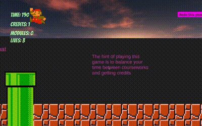

# Mario's Study Adventure: A Journey Through Durham University MCS 🎓🍄

Embark on an enlightening adventure with Mario, exploring the fields of Computer Science at Durham University!

## Table of Contents
- [Preview](#preview)
- [Gamestory](#gamestory)
- [Gamegenre](#gamegenre)
- [Prerequisites](#prerequisites)
- [Getting Started](#getting-started)
- [Asset & Package References](#asset--package-references)
- [Game Controls & Building](#game-controls--building)
- [Scenes Navigation & Testing](#scenes-navigation--testing)
- [The Adventure Story & Instructions](#the-adventure-story--instructions)
- [Acknowledgements & Resources](#acknowledgements--resources)
- [Game Testing](#game-testing)
- [File Descriptions](#file-descriptions)
- [Troubleshooting](#troubleshooting)

## Preview
### Game Preview

## Game Story
Mario enrols at Durham University to study computer science. He needs to get credits,
finish coursework, and find MCS building in a limited time while facing challenges from
Bowser's “Lazy factors”. With help from Frederick Li, he strives to earn his degree. Will he
succeed? Time will tell.

## Game genre
2D platform, Strategy, Puzzle, Simulation

## Prerequisites
### Unity Version
- **2021.3.17f1 (LTS)**
  - ⚠️ Ensure to utilize the recommended Unity version to mitigate compatibility issues.

## Getting Started
### Opening the Project
1. Launch **Unity**.
2. Click **Open**.
3. Navigate and select the project folder.
4. Hit **Open** and patiently wait for the project to load.

## Asset & Package References
### Essential Assets
- [8K Skybox Pack Free](https://assetstore.unity.com/packages/2d/textures-materials/sky/8k-skybox-pack-free-150926)

### Unity Packages Utilized
- TextMesh Pro ([Installation Guide](https://www.youtube.com/watch?v=bR0clpZvjXo&ab_channel=SpeedTutor))
- 2D, 2D Animation, and more *(...)*

## Game Controls & Building
### Gameplay Controls
- **A**: Left
- **D**: Right
- **W**: Up
- **S**: Down
- **Space**: Jump

### Build Instructions
1. Navigate: **File** > **Build Settings**
2. Select Target Platform
3. Click **Build**
   - Ensure all 16 scenes are configured in the build settings as follows:
     - Start > Instructions > 1.1 > ... > GameOver > GameStory

## Scenes Navigation & Testing
### Opening the First Scene
- Navigate to the scene folder and open the **Start** scene.

### Testing the Game within Unity
- Navigate and open **Start** scene, then press the **Play** button.
  - Note: Adjust the aspect ratio to **16:9** or maximize the play window if the full scene is not visible.

### Using Test Functions
- Enable direct level testing:
  - **1.1 Scene**: Canvas > Btn > Year2 > Enable.
  - **2.1 Scene**: Canvas > Btn > GoYear3 > Enable.
  - 📝 Note: Minigames need to be unlocked during gameplay by collecting 10 credits per level.

## The Adventure Story & Instructions
### Game Storyline
Join Mario, an illustrious plumber and now a student, as he delves into the theoretical and practical world of Computer Science at Durham University...

### Gameplay Instructions
- **Objective**: Unlock the CW minigame by collecting 10 credits per level.
- **Enemies**: Eliminate by jumping on them.
- **Coursework (CW)**: Located throughout each level; quantities vary.
- **Progression**: Locate and enter the MCS building post-CW completion to advance.

### Gameplay Challenges
Efficiently manage Mario’s time between completing coursework and acquiring credits!

## Acknowledgements & Resources
### Sprites, Music, & More
- Refer to detailed sprite, music, and code references [here](RESOURCE_FILE.md).

## Game Testing
- Compatibility validated for **Mac OS** and **Windows**.
- UAT conducted with various players; feedback indicates a balance of fun, excitement, and challenges.

## File Descriptions
- **Mario-s-Study-Adventure-A-journey-through-Durham-University-MCS**: Main Unity project folder.
- **GameVideo.Mov**: A brief, 1-minute gameplay video.
- **Game Specification Form**: Detailed game specs.

## Troubleshooting
- **Platform Error**: If a platform incompatibility warning surfaces, switch to the respective environment.
- **Font Mismatch Error**: For font issues, click the error and select "Fix Name" on the right.

---

Enjoy exploring the amalgamation of academia and adventure with Mario! Your feedback and contributions to the project are always welcomed and appreciated. Happy Gaming & Coding! 🚀🎓🍄
